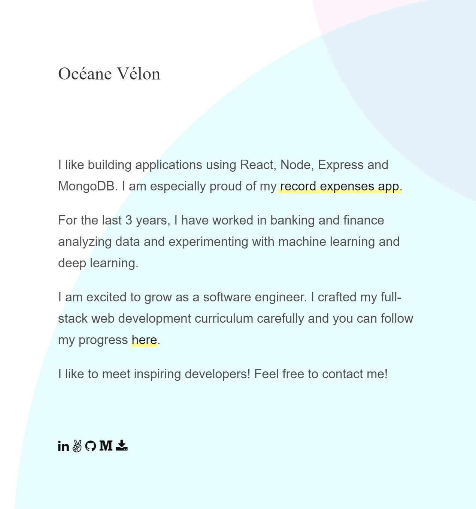

# 🌺 personal-site

**personal-site** is a minimalist one-page website built with html and css only.

A living demo is [here](https://oyane806.github.io/).

## Installation

Clone the project and open the index.html file.

## Usage

  
* This personal-site lists relevant links about myself.
* My resume can be downloaded by clicking the corresponding link.
* Two colored circles are slowly moving in the background.

## License
[MIT](https://choosealicense.com/licenses/mit/)